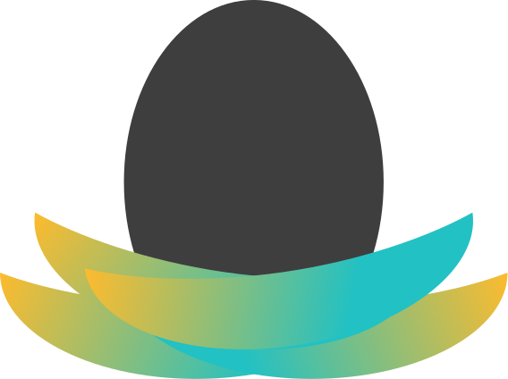

 

  
  <h3 align="center">Nest</h3>
  

    An immutable module registry for Deno, on the blockchain
 

 

  
 

## Nest web
This is the Nest website written in Next.js, deployed on our sponsor, [Vercel](https://vercel.com?utm_source=nest-land).

### Setup and serve (debug)
Please use the Yarn package manager, if you want to contribute to the front-end
- `yarn install`
- `yarn dev`

### Serve via Vercel
- `vc dev`  

## What is Nest?

Nest combines Deno with the [Arweave Blockchain](https://www.arweave.org/). With us, you can publish your Deno modules to the permaweb, where they can never be deleted. This avoids a major pitfall for web-based module imports while allowing the developer to maximize on the potential of Deno's import design!

## Repositories/Services

Nest is split into many services, each in their own respective repositories, they are as follows:

- [web](https://github.com/nestdotland/nest.land) - The landing repository for Nest.
  It houses the website source code.
- [eggs](https://github.com/nestdotland/eggs) - Nest's CLI
- [yolk](https://github.com/nestdotland/yolk) - Nest's API library
- [website](https://github.com/nestdotland/website) - Nest's website
- [API](https://github.com/nestdotland/api) - Nest's API
- [twig](https://github.com/nestdotland/twig) - A mediator for Nest's interactions with Arweave
- [x](https://github.com/nestdotland/x) - The module gateway for files to be accessed.

## Credits

### Authors

- [t8](https://github.com/t8)
- [justablob](https://github.com/justablob)

### Core Team

- [littledivy](https://github.com/littledivy)
- [maximousblk](https://github.com/maximousblk)
- [martonlederer](https://github.com/martonlederer)
- [oganexon](https://github.com/oganexon)

### Contributors

- [ebebbington](https://github.com/ebebbington)
- [yg](https://github.com/yg)
- [johnletey](https://github.com/johnletey)
- [qu4k](https://github.com/Qu4k)
- [keimeno](https://github.com/Keimeno)
- [hermitsun](https://github.com/HermitSun)

### Special Thanks

- [Cedrik Boudreau](https://github.com/cedriking)

### Inspirations

- [Deno Third-Party Modules](https://deno.land/x)

## Copyright

Nest is licensed under the MIT license. Please see the [LICENSE](../LICENSE) file.

  

